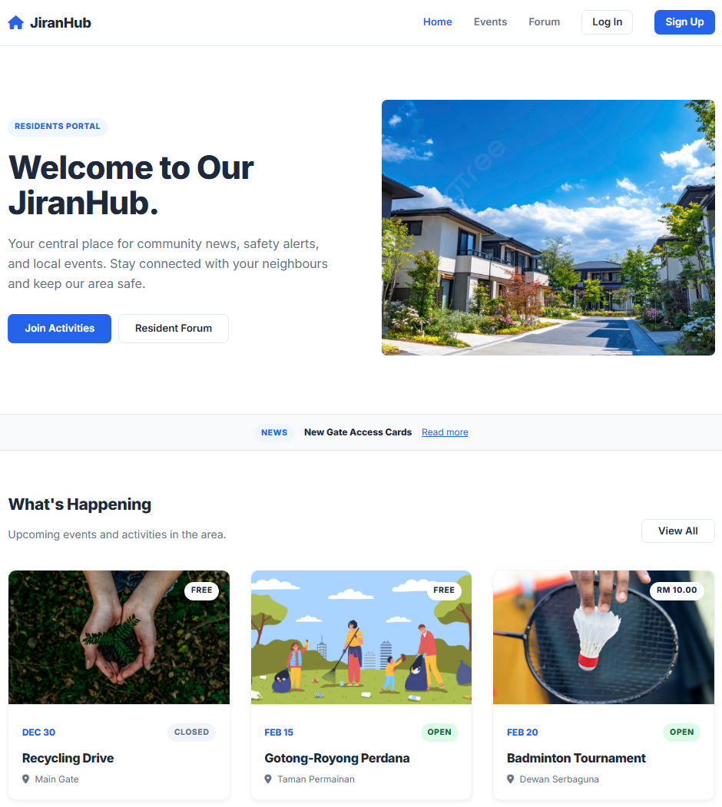
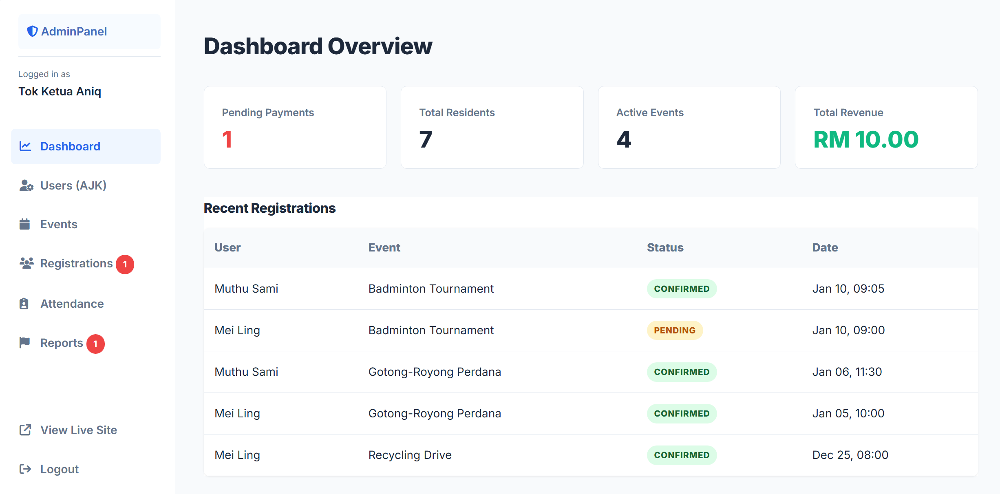

# 🏘️ JiranHub - Community Management System
  

A responsive, full-stack web application designed to centralize community event management. This project replaces manual registration with a digital ecosystem for tracking participants, managing payments, and facilitating community discussions using a **"Clean Hybrid"** UI theme.

Users can register for events, upload payment receipts, scan QR codes for attendance, and discuss local issues via a built-in forum.

---

## 💡 Project Overview

This application was developed as a group project for the **Web Technology (KP34903)** course at Universiti Malaysia Sabah (UMS).

It demonstrates a complete MVC-style architecture using native PHP, featuring Role-Based Access Control (RBAC) for Residents, Organizers, and Administrators.

---

## 🚀 Features

### 👤 User & Role Management
- **RBAC System:** Distinct dashboards for **Admins** (System oversight), **Organizers** (Event creators), and **Residents** (Participants).
- **Secure Auth:** Hashed passwords and session management.

### 📅 Event & Attendance
- **Event Creation:** Organizers can set limits (max slots), prices, and locations.
- **QR Code Scanner:** Integrated `html5-qrcode` library allows organizers to scan user tickets for real-time attendance tracking.
- **Search & Filter:** AJAX-based search bar for instant event filtering.

### 💸 Financial & Verification
- **Payment Workflow:** Users upload receipt images -> Organizers view proofs -> Approve/Reject.
- **Revenue Tracking:** Admin dashboard calculates total income and active registrations.

### 💬 Community Engagement
- **Forum:** Threaded discussions for "Safety Alerts", "Marketplace", and "General" topics.
- **Moderation:** Reporting system allowing admins to flag and delete inappropriate content.
- **Notifications:** Real-time alerts when payments are approved or forum topics get replies.

---

## 📸 Project Screenshots

| User Landing Page | Admin Dashboard |
|:---:|:---:|
|  |  |

---

## 🛠️ Built With

- **PHP** (Native)
- **MySQL** (Relational Database)
- **JavaScript** (Vanilla + AJAX)
- **HTML5 / CSS3** (Custom "Clean Hybrid" Design)
- **Library:** `html5-qrcode` (Scanner)

---

## 📁 Project Structure
```text
JiranHub/
├── admin/               # Backend management (Dashboard, Users, Reports)
├── api/                 # AJAX handlers for search and updates
├── assets/              # CSS styles and static images
├── includes/            # Reusable components (Navbar, Footer)
├── uploads/             # Storage for user banners, receipts, and profiles
│   ├── .gitkeep         # Preserves folder structure on GitHub
├── db.php               # Database connection settings
├── jiranhub_db.sql      # Database import file (Structure + Sample Data)
├── index.php            # Landing page
├── README.md            # This file
└── ...                  # Other core files (Login, Register, Events)
```

---

## ▶️ How to Run

1. Clone this repository:
   ```bash
   git clone https://github.com/anake-an/JiranHub.git
2. Move the folder to your server directory (e.g., htdocs in XAMPP or www in WAMP).
3. Open phpMyAdmin and create a database named jiranhub_db.
4. Import the jiranhub_db.sql file located in the root directory.
5. Check db.php to ensure connection settings match your server (Default is root/empty).
6. Open your browser and go to http://localhost/JiranHub.

---

## ⚡Setup Admin Access

Since the database does not contain pre-filled users, follow these steps to create an Admin account:
1. Go to the website and click Sign Up to create a new account.
2. Go to phpMyAdmin > Select jiranhub_db > Open the users table.
3. Find your newly created user row.
4. Manually change the role column value from resident to admin.
5. Log out and Log back in. You will now have access to the Admin Dashboard.

---

## 👥 Contributors

This project was originally developed as a group assignment for the KP34903 Web Technology course (Group 7).

| Name                                   | Profile Link                                                            |
|----------------------------------------|-------------------------------------------------------------------------|
| **Aniq Najmuddin Bin Sharifuddin**     | [Linkedin](https://www.linkedin.com/in/aniqnaj)                         |
| Muhammad Faris Bin Huzaimi             | [LinkedIn](https://www.linkedin.com/in/farishuz)                        |
| Muhammad Isyraf Ahnaf Bin M. Zamri     | [LinkedIn](https://www.linkedin.com/in/muhammad-isyraf-ahnaf-320557256) |
| Muhammad Saifullah Bin Rosman          | [LinkedIn](https://www.linkedin.com/in/muhammad-saifullah-5a3481272)    |

